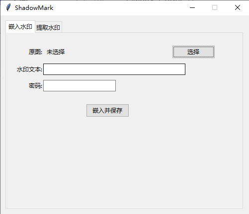

# ShadowMark

一个基于 Python 的图片隐写工具，支持在图片中嵌入和提取隐藏文本信息。



## 功能特性

- 🔒 **嵌入水印**：在原图中隐藏文本信息
- 🔓 **提取水印**：从隐写图片中提取隐藏的文本内容
- 🎨 **图形界面**：使用 Tkinter 构建简洁易用的 GUI
- 🔐 **密码保护**：支持密码加密，提升安全性

## 技术栈

- Python 3.x
- [blind_watermark](https://github.com/guofei9987/blind_watermark) - 盲水印库
- Tkinter - GUI 框架
- Pillow - 图像处理

## 安装

```bash
pip install -r requirements.txt
```

## 使用方法

```bash
python main.py
```

### 嵌入水印

1. 点击"嵌入水印"标签页
2. 选择原图
3. 输入要隐藏的文本内容
4. 设置密码
5. 点击"嵌入并保存"，选择保存位置
6. 记录生成的水印长度（提取时需要）

### 提取水印

1. 点击"提取水印"标签页
2. 选择隐写图片
3. 输入嵌入时记录的水印长度
4. 输入密码（需与嵌入时一致）
5. 点击"提取水印"，查看提取结果

## 注意事项

- 嵌入和提取时必须使用相同的密码
- 水印长度在嵌入后会显示，请妥善保存
- 建议使用 PNG 格式以确保最佳效果
